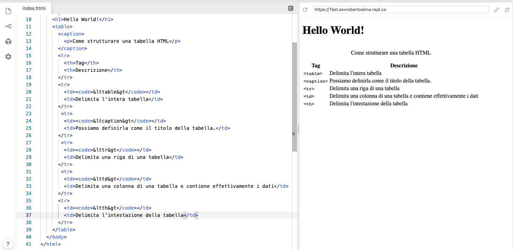
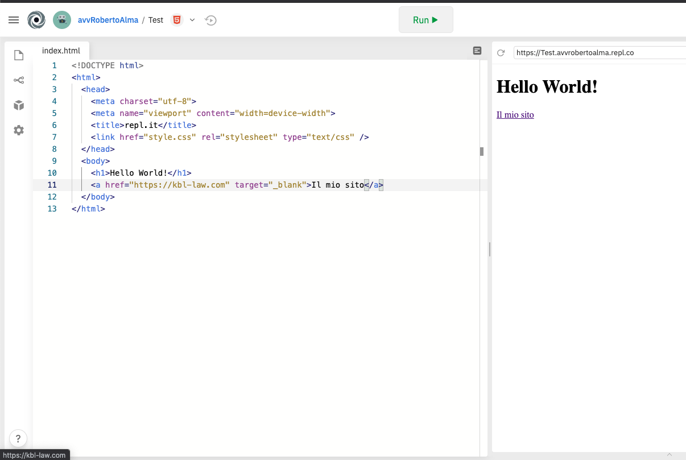
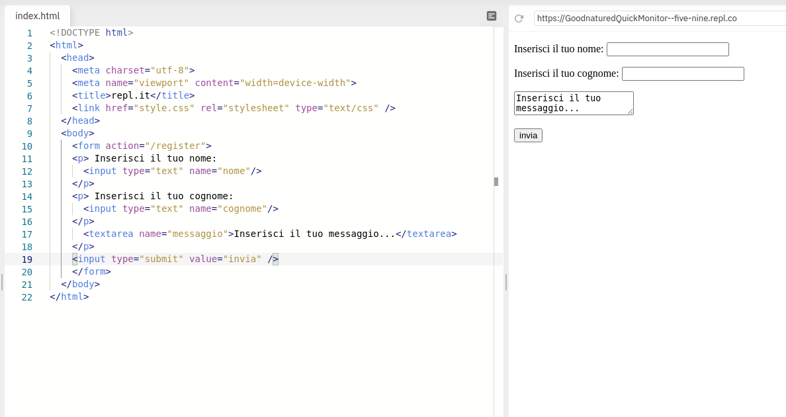
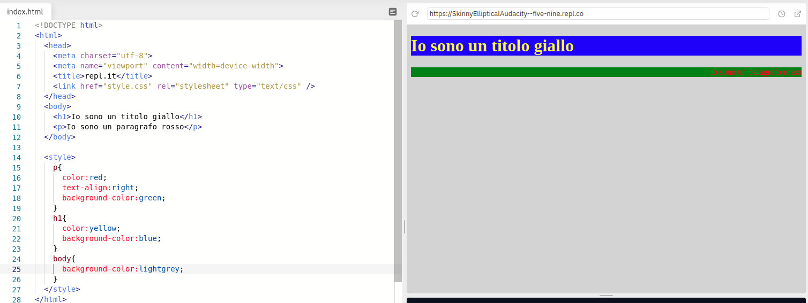
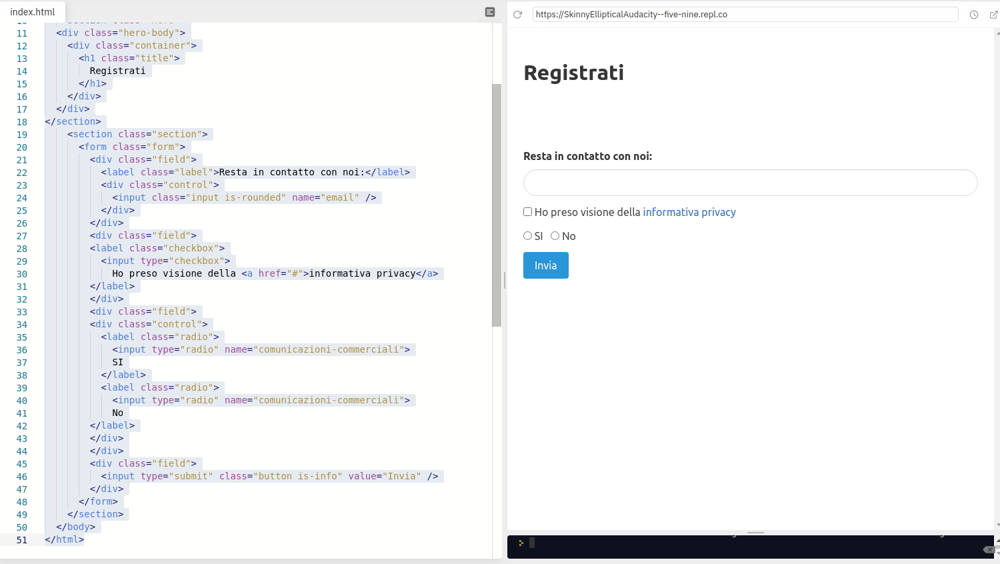
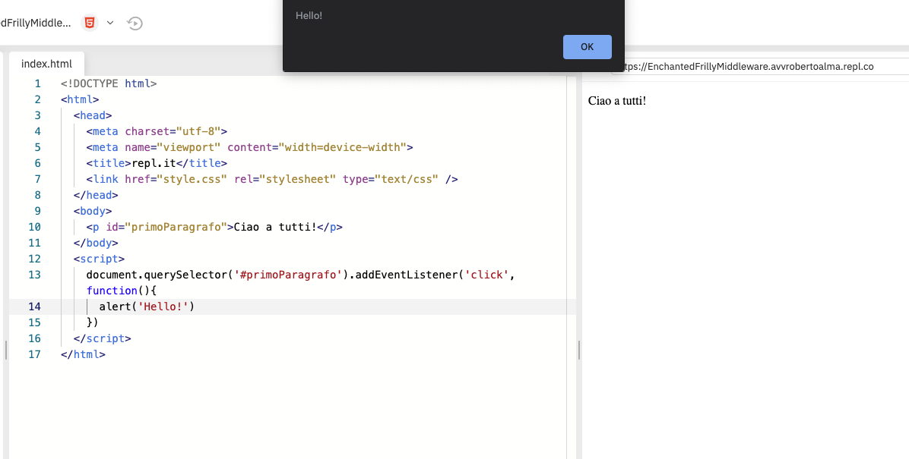
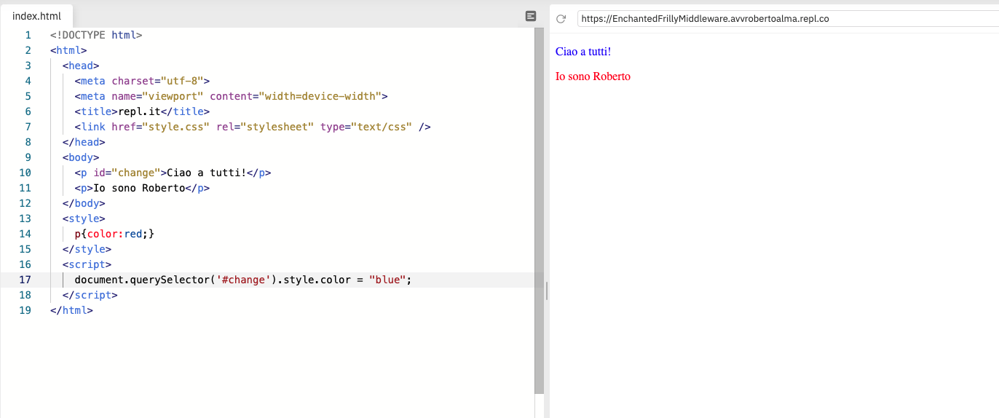
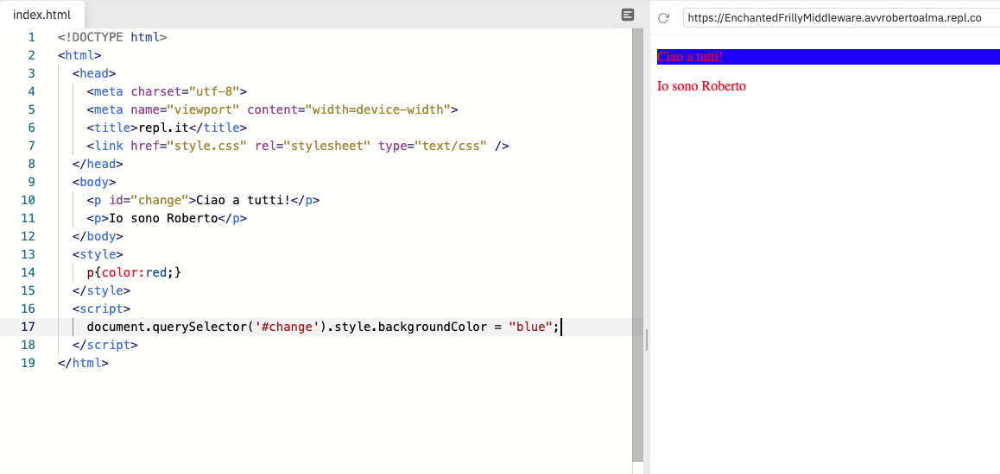

# Programmare per il WEB

## Basi di HTML

### Introduzione all'HTML

**HTML** è l’acronimo di *HyperText Markup Language* (“Linguaggio di contrassegno per gli Ipertesti”) e non è un vero e proprio linguaggio di programmazione. Si tratta invece di un **linguaggio di markup** (di ‘contrassegno’ o ‘di marcatura’), che, sostanzialmente, descrive come disporre gli elementi all’interno di una pagina.

Quando navighiamo su qualunque pagina web, il nostro browser non fa altro che interpretare il contenuto HTML della pagina in questione al fine di visualizzare sullo schermo gli elementi della pagina, in conformità a quanto indicato nel testo HTML.


Come potete vedere in questo esempio, abbiamo due grandi riquadri:

1. il riquadro di sinistra contiene la rappresentazione della pagina in formato HTML;
2. il riquadro di destra contiene la rappresentazione effettiva della pagina sul nostro browser.

L'elemento caratteristico dell'HTML è costituito dall'utilizzo dei **tag** o **etichette**. Si tratta dei marcatori che andremo ad utilizzare per inserire gli elementi all'interno della pagina. Hanno la peculiarità di essere racchiusi tra parentesi angolari.

Per fare un esempio, il **tag** `<h1>` identifica il **Titolo 1** del nostro documento. Più precisamente, nella pagina sopra indicata, la sintassi corretta è `<h1>Hello World!</h1>`.Il senso è il seguente:

*Tutto ciò che è compreso tra il **tag** di apertura (`<h1>`) e quello di chiusura (`</h1>`) è rappresentato dall'elemento **Titolo 1**.* 

> La sintassi dei **tag** HTML è costituita da `<tag> contenuto </tag>`. Ci sono però alcune eccezioni.

A questo punto, esaminiamo la pagina sopra riportata al fine di estrarre i relativi **tag**.

| Tag               | Descrizione                                                  |
| ----------------- | ------------------------------------------------------------ |
| `<!DOCTYPE html>` | Serve semplicemente a comunicare al browser che il file è una pagina HTML redatta secondo lo standard HTML5. |
| `<html>`          | È il tag che racchiude tutta la pagina. Volendo, possiamo specificare la lingua della pagina, utilizzando l’attributo `lang="it"` |
| `<head>`          | Questo **tag** contiene una serie di informazioni utili per la gestione della pagina. Ad esempio può conterere il titolo che apparirà nei motori di ricerca e sulle etichette del browser (come abbiamo fatto utilizzando il tag `<title>` ). Solitamente in questa sezione si inseriscono le regole di stile e, a seconda dei casi, anche gli script di *javascript* |

Utilizzando i comuni browser è possibile sempre verificare il codice sorgente HTML di qualsiasi pagina web. Ad esempio, con **chrome** è sufficiente cliccare su un punto qualsiasi della pagina con il tasto destro e selezionare l'opzione: **ispeziona**.

Tra l'altro, nel momento in cui si utilizzano gli strumenti per sviluppatori di Chrome è anche possibile modificare in tempo reale l'aspetto della pagina.


Per fare ciò, è sufficiente accedere agli strumenti per sviluppatori, cliccare nel riquadro di sinistra sulla sintassi HTML della pagina e modificare il contenuto dei singoli elementi della pagina. 

### Elementi e TAG

Abbiamo, quindi, visto che in una pagina HTML tutti gli elementi sono rappresentati da **tag**. Queste etichette hanno la funzione di descrivere il tipo di elemento che poi sarà rappresentato nel browser. Tuttavia, sarebbe scorretto assegnare ai **tag** un ruolo meramente grafico o estetico. La principale funzione del **tag** è a livello semantico. Assegnare il **tag** `<h1>` invece del tag `<h2>` non ha, infatti, esclusivamente un risvolto grafico (che potrebbe essere modificato con il CSS), ma anche e, soprattutto, la funzione di specificare che si tratta di un **Titolo 1** piuttosto che di un **Titolo 2**.

Abbiamo già detto che, generalmente, la sintassi di un elemento HTML è la seguente: `<tag> contenuto </tag>`. In questo caso si parla di elementi **contenitori**. Il contenuto è delimitato, infatti, da:

- un **tag** di apertura (es. `<h1>`)
- un **tag** di chiusura (es. `</h1>`)

Tutto ciò che è compreso tra il **tag** di apertura e quello di chiusura è, infatti, il **contenuto** dell'elemento (es. il contenuto del **Titolo 1**, del **Titolo 2**, del semplice **paragrafo** e così via)

Torniamo all'esempio di prima che riproponiamo qui di seguito.


Possiamo notare che il nostro **Titolo 1** (*Hello World*) è, a sua volta, racchiuso da un elemento `<body> </body>` e, a sua volta, da un elemento `<html></html>`. Questo perché l'HTML è, sostanzialmente, come un grande **albero** dove i rami sono degli elementi **contenitori** e le estremità sono composte da **elementi non contenitori** come testi, immagini o caselle di input.

### Attributi

Gli **attributi** forniscono ulteriori informazioni sul contenuto di un elemento HTML. 

Sono inseriti all'interno del **tag** di apertura e sono composti da:

- un **nome**;
- il simbolo uguale;
- un **valore** (tra virgolette);

Ad esempio:

```html
<p id="first-paragraph">
    Questo è un paragrafo
</p>
```

Qui abbiamo utilizzato l'attributo `id` che viene impiegato per assegnare un **riferimento univoco** ad un elemento della pagina. Molto utile ove sia necessario manipolare la pagina con istruzioni *Javascript* o tramite un foglio di stile CSS.

Vediamo quali sono i principali **attributi**

| Attributo | Descrizione                                                  |
| --------- | ------------------------------------------------------------ |
| `id`      | Riferimento univoco di un elemento HTML                      |
| `class`   | Può contenere una o più classi CSS                           |
| `style`   | Può contenere una o più istruzioni di stile                  |
| `name`    | Utilizzato all'interno degli elementi di un **form**. Servirà per associare un riferimento ai dati inseriti dall'utente, allo scopo di consentirne l'elaborazione da parte di un server. |


### Alcuni tipi di Elementi

| Tag                                  | Descrizione                                                  |
| ------------------------------------ | ------------------------------------------------------------ |
| da `<h1>` a `<h6>`                   | Sono i Titoli (ovviamente da Titolo 1 a Titolo 6)            |
| `<p>`                                | SI tratta del **paragrafo**. Al termine di ogni **paragrafo** si va a capo. Attenzione! Se inserisco due frasi all'interno di un elemento **paragrafo**, non andrò a capo neanche se digiterò il tasto INVIO. Per forzare l'interruzione di riga all'interno di un **paragrafo** si utilizza il **tag** `<br />` (*breakline*) |
| `<b>` o più correttamente `<strong>` | Si tratta del **grassetto** (*bold*) che rappresenta una cd. *strong emphasis* |
| `<em>`                               | Si tratta del **corsivo** (anche se più correttamente si riferisce non tanto allo stile, quando a concetti che vanno **enfatizzati**) |
| `<ul>` e `<ol>`                      | Si tratta, rispettivamente, della **lista non ordinata** e della lista **ordinata** |
| `<li>`                               | Si tratta del singolo elemento di una **lista ordinata** o di una **lista non ordinata** |

Proviamo a scrivere una pagina di esempio in cui ci presentiamo, utilizzando combinazioni di questi elementi.


Commentiamo il codice sopra indicato:

- l'elemento `<h1> </h1>` racchiude il **Titolo 1** che non è stato modificato;
- l'elemento `<p></p>` racchiude del testo in cui abbiamo indicato alcune parole in **grassetto** (tag `<b> </b>`) ed altre in *corsivo* (tag `<em> </em>`);
- l'ulteriore elemento `<p></p>` racchiude del testo e un elenco puntato (`<ul> </ul>`) con tre elementi (`<li> </li>`);
- infine abbiamo un ultimo elemento `<p></p>`.

A questo punto non resta che fare un po' di pratica!

### I commenti

I **commenti** in HTML, come in altri linguaggi (come poi vedremo), permettono di aggiungere alla pagina una serie di annotazioni che non incidono sulla sua visualizzazione. Hanno le seguenti funzioni: 

- Scrivere annotazioni generiche;
- Rendere inattive porzioni di codiceper effettuare dei test;
- Segnalare la chiusura di blocchi di codice per evitare confusione (specialmente in presenza di strutture molto annidate);

Il commento si inserisce utilizzando la seguente sintassi:

`<!-- COMMENTO -->`


### Le Tabelle

In HTML una **tabella** è delimitata dai **tag** `<table> </table>` ed ha la seguente composizione:

| Tag         | Descrizione                                                  |
| ----------- | ------------------------------------------------------------ |
| `<table>`   | Delimita l'intera tabella                                    |
| `<caption>` | Possiamo definirla come il titolo della tabella.             |
| `<tr>`      | Delimita una riga di una tabella                             |
| `<td>`      | Delimita una colonna di una tabella e contiene effettivamente i dati |
| `<th>`      | Delimita l'intestazione della tabella                        |

Riproduciamo quanto abbiamo scritto sopra.



Noterete l'utilizzo di alcuni **tag** come:

- `<code></code>` che si utilizza per identificare semanticamente porzioni di codice;
- `&lt` e `&gt` che rientrano nelle cd. **entità HTML**. Si utilizzano per rappresentare dei simbolli che potrebbero essere letti dal browser come delle entità HTML vere e proprie, quando, invece vogliamo solo inserirle come puro testo.

### I link

Elemento centrale del **web**, la possibilità di collegare pagine diverse (ma anche elementi diversi di una stessa pagina) è resa possibile dall'utilizzo del **tag** `<a> </a>`. La sintassi del **link** è la seguente:

- **tag** di apertura - `<a>`
- **attributo** `href` che contiene l'indirizzo della risorsa verso cui effettuare il collegamento;
- **attributo** `_target` (eventuale), si utilizza per far aprire una pagina diversa del browser (mediante il valore `_blank`)
- **contenuto** del link (ossia l'elemento su cui materialmente effettuare il *click*)
- **tag** di chiusura - `</a>`

Vediamo un semplice esempio.



### I Form

Per concludere la nostra breve panoramica sul linguaggio HTML, parliamo dei form che rappresentano l'elemento **principale** per raccogliere i dati dell'utente.

#### Come funzionano i form? (metodo classico)

1. L'utente inserisce i dati all'interno del form;
2. Ogni elemento del form ha un suo attributo speciale chiamato `name`. Es. ci potrebbe essere una casella di testo (`<input type="text"/>`) dove l'utente dovrà inserire il suo nome. Probabilmente l'attributo `name` di quell'elemento sarà proprio `nome`. Nel momento in cui l'utente inserirà il valore es. *Roberto*, verrà creata una associazione tra quel particolare attributo `name` e quel particolare valore *Roberto*;
3. Nel momento in cui si cliccherà sul pulsante *Invia*, i dati relativi a quel form verranno inviati al *server* che, nel nostro caso di esempio, verrà a conoscenza che quel determinato attributo `name` ha come valore *Roberto*;
4. il server processerà le informazioni utilizzando un linguaggio di programmazione *server-side* (come PHP, Python, Node.js ecc.) ed effettuerà le operazioni desiderate (es. registrerà l'utente all'interno del database);
5. Verrà alla fine inviata una risposta al *browser* (es. un messaggio che informa l'utente che l'operazione è andata a buon fine, una nuova pagina, ecc.)

#### La struttura di base dei form

Tutti gli elementi che costituiscono un **form** sono delimitati generalmente da un elemento di tipo `<form> </form>`.

Tra gli **attributi** principali del **form** si indicano:

| Attributo | Descrizione                                                  |
| --------- | ------------------------------------------------------------ |
| `method`  | Può avere come valore `GET` o `POST`. Solitamente si utilizza `POST` quando devono essere inviati dati complessi (es. file) o rilevanti (es. dati personali come email e/o password) |
| `action`  | Il suo valore è l'indirizzo della pagina cui dovranno essere inviati i dati. Es. la pagina `/register` per registrare un nuovo utente. |

#### Alcuni degli elementi principali dei form

| Elemento                                                     | Descrizione                                                  |
| ------------------------------------------------------------ | ------------------------------------------------------------ |
| `<input type="text" name="cognome" />`                       | Il classico campo per inserire del testo (in questo caso verrà creata una associazione tra il valore che verrà inserito e il `name` identificato come `cognome`) |
| `<textarea name="messaggio" cols="20" rows="4">Inserisci il tuo messaggio</textarea>` | L'elemento `<textarea>` viene utilizzato per inserire del testo composto da più righe. Qui verrà creata una associazione tra il `name` identificato come `messaggio` e il valore del nostro messaggio. |
| `<input type="submit" value="invia" />`                      | Si tratta dell'elemento utilizzato per inviare i dati inseriti al server. Solitamente è rappresentato da un bottone. |

Predisponiamo un semplice esempio:



Come possiamo notare, l'aspetto estetico del nostro **form** è tutt'altro che invitante, ma sul punto interverremo successivamente con il **CSS**.

Vediamo ora altri elementi utili per la creazione di **form**.

| Elemento                                                     | Descrizione                                                  |
| ------------------------------------------------------------ | ------------------------------------------------------------ |
| `<input type="radio" name="consenso-marketing" value="SI" />` <br />`<input type="radio" name="consenso-marketing" value="NO" />` | SI tratta del **radio button** ossia di un elemento che pone di fronte all'utente due o più opzioni da scegliere.<br />In questo caso stiamo simulando una richiesta di consenso per la ricezione di comunicazioni commerciali che può avere due valori possibili: *SI* o *NO*. Notiamo come l'attributo `name` sia però lo stesso nei due elementi `input`. |
| `<input type="checkbox" name="consenso-marketing" value="yes" />` | Questa è, invece, la **checkbox**. In questo caso, però, se l'utente seleziona la **checkbox**, il valore sarà quello dell'attributo `value` qualora i dati siano inviati al server. |
| `<select name="comunicazioni"><option value="mail">Email</option><option value="SMS">SMS</option></select>` | Si tratta del menu a tendina, in cui, l'utente potrà scegliere una delle opzioni proposte. Verrà creata una associazione tra il `name` (in questo caso *comunicazioni*) e il `value` della opzione prescelta. |

Strutturiamo ora un determinato *form* per la registrazione ad una newsletter.


Come vedete, abbiamo utilizzato:

- un campo testuale (per ottenere la mail dell'utente);
- una checkbox per assicurare la presa visione dell'informativa privacy (in relazione alla quale abbiamo predisposto un *hyperlink* al testo completo);
- un bottone **radio** per far esprimere all'utente in modo chiaro e trasparente la propria scelta in merito alla ricezione delle comunicazioni commerciali.


## Introduzione al CSS

Il **CSS** (fogli di stile a cascata o *Cascade Stylesheets*) è un linguaggio usato per definire la formattazione di documenti HTML (ma anche XHTML e XML) e, quindi, per conferire maggiore attrattività, ad esempio, alle nostre pagine web.. Le regole per comporre il CSS sono contenute in un insieme di direttive (Recommendations) emanate a partire dal 1996 dal W3C.

L'introduzione del CSS consente una gestione ordinata delle pagine WEB, in quanto nei file `.html` viene definio il contenuto della pagina dal punto di vista semantico e strutturale, nei file `.css`, invece vengono definite tutte le **regole di stile** che incidono sulle modalità di visualizzazione di una pagina. 

### Che cosa sono le regole di stile?

Il **CSS** opera associando delle **regole di stile** agli elementi HTML. Queste regole specificano come i singoli elementi della pagina devono essere visualizzati.

La struttura di una **regola di stile** consiste di:

- un **selettore** che identifica l'elemento o gli elementi ai quali deve essere applicata quella nuova **regola**;
- una **dichiarazione** che definisce lo stile da applicare agli elementi cui si riferisce il **selettore**;

Vediamo un esempio.

```css
/* questa regola ha come selettore il tag <p> 
significa che si applicherà a tutti i paragrafi della pagina
la dichiarazione è `color:red;`  e comporterà l'applicazione del colore rosso al testo di tutti i paragrafi della pagina */
p {
  color: red;
}
```

Altro esempio:

```css
/* questa regola ha come selettore il tag <h1> 
significa che si applicherà a tutti i Titoli 1 della pagina
la dichiarazione è `color:yellow;`  e comporterà l'applicazione del colore giallo al testo di tutti i Titoli 1 della pagina */
h1 {
  color: yellow;
}
```

Mettiamo in pratica su **repl**.


Per semplicità, abbiamo inserito le regole di stile all'interno di un tag `<style>` (avremmo anche potuto inserirle all'interno del file `style.css` che è richiamato nella sezione `<head>`).

Altre proprietà che potremmo utilizzare sono:

- `background-color` possiamo decidere di applicarlo a tutta la pagina (utilizzando come selettore il tag `body`) o a singoli elementi.
- `text-align` che può avere come valori: `left`, `right`, `center`, `justify`

Proseguiamo con il nostro esempio.

Vogliamo che il titolo abbia come sfondo il colore blu, il paragrafo abbia come sfondo il colore verde e sia allineato a destra e la pagina abbia come sfondo un colore grigio chiaro.



Come vedete, abbiamo raggiunto l'obiettivo.

Ma dovrebbe sorgere un dubbio: 

*per quale ragione il paragrafo ha lo sfondo verde, se avevamo indicato lo sfondo grigio chiaro a tutta la pagina?*

La risposta è proprio nella natura del CSS che abbiamo definito come *fogli di stile a cascata*.

In sostanza, è possibile che due differenti **regole di stile** possa essere applicata allo stesso elemento (come nel caso sopra indicato) è importante stabilire quale regola abbia la precedenza.

| Criterio di precedenza | Descrizione                                                  |
| ---------------------- | ------------------------------------------------------------ |
| *Last Rule*            | Se due **selettori** sono identici e prevedono regole di stile incompatibili fra loro, sarà applicato l'ultimo dei due |
| *Specificity*          | Se due **selettori** sono diversi, ma prevedono regole di stile incompatibili fra loro, sarà applicato quello più specifico |
| *Important*            | Se viene inserita la parola `!important` dopo una dichiarazione, questa prevarrà su tutte le altre regole. |

Per comprendere appieno il funzionamento delle regole CSS è fondamentale comprendere quali possano essere i **selettori**.

#### I selettori

Abbiamo finora utilizzato come **selettori** unicamente tag HTML come `<p>` o `<h1>`, ma il CSS ci fornisce molte ulteriori possibilità. Vediamo i principali **selettori**.

| Selettore    | Descrizione                                                  | Esempio                                                      |
| ------------ | ------------------------------------------------------------ | ------------------------------------------------------------ |
| *UNIVERSALE* | Si applica a tutti gli elementi della pagina                 | `* { color:red;}` <br />Applica il colore rosso al testo di qualsiasi elemento della pagina. |
| *TIPO*       | Si applica all'elemento corrispondente                       | `p { color:red;}`<br />Applica il colore rosso al testo di tutti i paragrafi della pagina, ma non, ad esempio, ai Titoli 1. |
| *ID*         | Si applica all'elemento il cui attributo `id` coincide con quello del selettore. | `#pippo {color:red;}` <br />Applica il colore rosso al testo dell'elemento che ha come `id` *pippo* |
| *CLASSE*     | Si applica all'elemento il cui attributo `classe` coincide con quello del selettore. | `.pippo { color:red; }`<br />Applica il colore rosso al testo di tutti gli elementi che hanno come attributo `class` *pippo* |

Per una **lista** di tutte le proprietà disponibili, si consiglia di consultare il *tutorial* di [Tutorial Republic](https://www.tutorialrepublic.com/css-reference/css3-properties.php)

#### Framework CSS

Si tratta di insiemi di regole di stile già predisposti e solitamente open source, ben documentati, che possono essere utilizzati per generare gradevoli *layout* alle nostre pagine, senza dover *reinventare la ruota*.

I più famosi sono [Bootstrap](https://getbootstrap.com/), [Bulma](https://bulma.io), [Semantic UI](https://semantic-ui.com/), etc.

Per fare un esempio, riscriviamo il nostro *form* di registrazione alla *newsletter*, utilizzando BULMA.

```html
<!DOCTYPE html>
<html>
  <head>
    <meta charset="utf-8">
    <meta name="viewport" content="width=device-width">
    <title>repl.it</title>
    <link rel="stylesheet" href="https://cdn.jsdelivr.net/npm/bulma@0.9.1/css/bulma.min.css">
  </head>
  <body>
   <section class="hero">
  <div class="hero-body">
    <div class="container">
      <h1 class="title">
        Registrati
      </h1>
    </div>
  </div>
</section>
    <section class="section">
      <form class="form">
        <div class="field">
          <label class="label">Resta in contatto con noi:</label>
          <div class="control">
            <input class="input is-rounded" name="email" />
          </div>
        </div>
        <div class="field">
        <label class="checkbox">
          <input type="checkbox">
            Ho preso visione della <a href="#">informativa privacy</a>
        </label>
        </div>
        <div class="field">
        <div class="control">
          <label class="radio">
            <input type="radio" name="comunicazioni-commerciali">
            SI
          </label>
          <label class="radio">
            <input type="radio" name="comunicazioni-commerciali">
            No
        </label>
        </div>
        </div>
        <div class="field">
          <input type="submit" class="button is-info" value="Invia" />
        </div>
      </form>
    </section>
  </body>
</html>
```

Ed ecco l'output:



## Introduzione a JAVASCRIPT

Per concludere la nostra **introduzione** alla programmazione WEB, dedichiamo un po' di spazio anche a **JAVASCRIPT**.

Si tratta di un linguaggio di programmazione vero e proprio, molto flessibile, ed oggi utilizzato per molteplici finalità: 

- creazione di applicazioni desktop (tramite il progetto **Electron.js**);
- creazione di server web (tramite **Node.js** e i framework collegati come **Express.js**);
- creazione di applicazioni web (tramite **Angular.js**, **React.js**, **Vue.js**);
- creazione di applicazioni mobile (tramite **React Native**);

Ma originariamente è nato per aggiungere degli effetti **dinamici** alle pagine WEB (es. comparsa/scomparsa di elementi dalla pagina; cambio di colori in modo dinamico; visualizzazione di alert ecc.).

La prima cosa da comprendere è: 

*Come si può interagire con un elemento della pagina tramite JAVASCRIPT*?

In modo molto semplice, utilizzando gli stessi selettori CSS che abbiamo visto sopra, prediligendo quelli univoci come l'`id`.

Proviamo a scrivere il nostro primo codice Javascript che commenteremo passo passo.



Commentiamo il codice

```html
<script>
  <!-- tutto ciò che è compreso tra i tag <script> contiene il nostro codice javascript-->
</script>
```

A questo punto dobbiamo studiare i seguenti concetti:

- `primoParagrafo` è l'`id` del paragrafo con cui ci interessa interagire;
- `document.querySelector()` è un metodo Javascript che ci consente di selezionare un elemento della pagina (*rectius* del DOM);
- .addEventListener() è un metodo Javascript che ci consente di associare un certo comportamento al verificarsi di un determinato evento;
- `'click'` è l'evento che vogliamo gestire (il *click* del *mouse* sull'elemento che ci interessa);
- `function(){ alert('Hello')}` è la funzione che sarà eseguita (ossia il blocco di codice) al verificarsi dell'evento 'click'.

Probabilmente qui avrete trovato dei concetti nuovi (metodo, funzione, codice, ecc.). Tutto sarà più chiaro al termine del corso su Python, in quanto tutti i linguaggi di programmazione condividono alla base le stesse macro-logiche.

Ai fini di questa sessione, è unicamente utile rendersi conto di come gli **script** possano interagire con il DOM.

Perché un avvocato dovrebbe avere rudimenti di **Javascript**?

Per tante ragioni. Solitamente il codice javascript è contenuto all'interno di specifici file con estensione `.js` ma non è sempre così. Può accadere che lo script sia strutturato nel seguente modo `<script src="https://kbl-law.com/script.js"></script>`. In questo caso non stiamo facendo altro che caricare del codice javascript formalmente realizzato da una entità esterna, ma che sarà eseguito sulla nostra pagina e potrà provocare dei cambiamenti nel contenuto della pagina o anche delle differenti interazioni con gli utenti:

- potrebbero essere salvati dati nel `localStorage` (un'area del browser dove possono essere salvate delle informazioni);
- potrebbero essere salvati dei cookie (per un successivo utilizzo da parte di altri server, es. da parte di Facebook per conoscere la provenienza di un utente x e far visualizzare pubblicità personalizzata)
- potrebbero semplicemente essere trasmessi dati a risorse esterne (es. potrei informare il sito KBL che l'utente x sta compiendo una certa azione sulla mia pagina ecc.)

Per un approfondimento speciale su Javascript consigliamo di seguire i tutorial disponibili sul sito [W3C](https://www.w3schools.com/js/DEFAULT.asp).

Ai fini di questa lezione, ci limiteremo a illustrare solo alcuni altri semplici esempi.

Potremmo semplicemente voler cambiare il colore di un particolare paragrafo nel momento in cui lo script viene eseguito.



Cosa è accaduto in questo caso?

- abbiamo due paragrafi: uno dei quali ha un attributo `id` e l'altro no;
- abbiamo una regola CSS che applica il colore rosso a tutti i paragrafi;
- abbiamo uno script JS (eseguito al termine del caricamento della pagina) che modifica il colore del solo paragrafo con attributo `id` uguale a *change* in BLUE;

Altro esempio, lasciamo invariata la regola del colore del paragrafo e facciamo modificare il colore di sfondo allo script.



Notare che abbiamo utilizzato la proprietà `backgroundColor` che apparentemente differisce dallo standard CSS `background-color`. Semplicemente, Javascript non gestisce il trattino nel nome delle proprietà di un oggetto, per cui occorre utilizzare la cd. sintassi *camelCase*. Semplicemente come "discontinuità", in luogo del trattino si dovrà utilizzare la prima lettera della parola successiva con la lettera maiuscola.

A questo punto, non resta che provare a realizzare alcuni esempi! 

